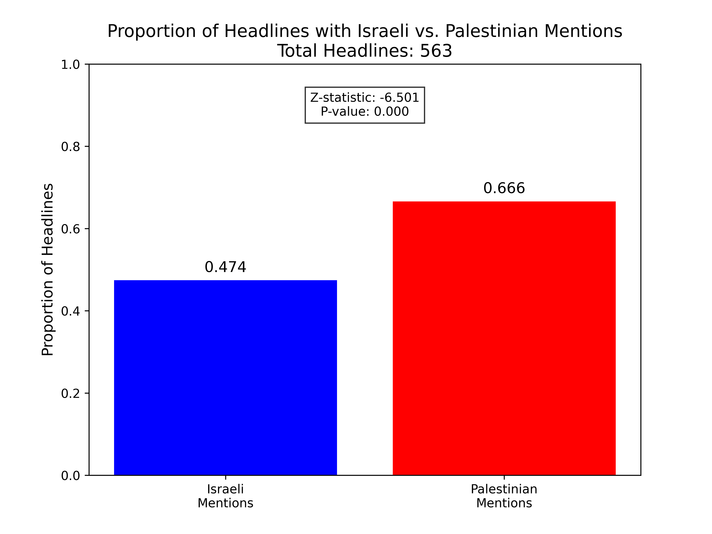
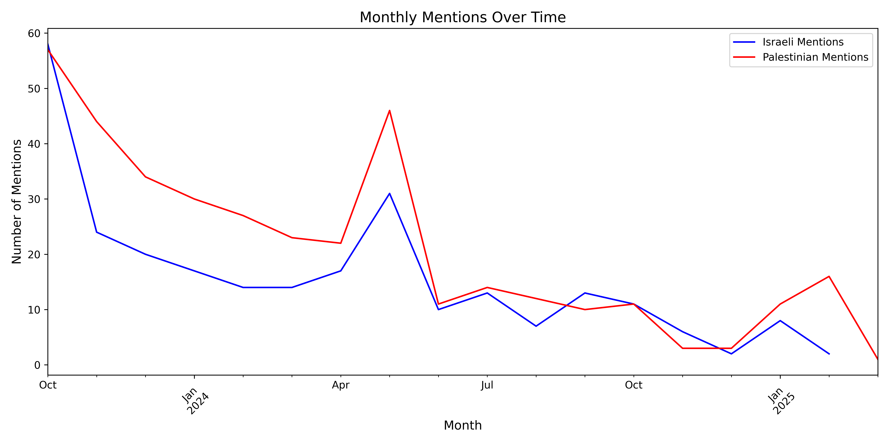

# Analyzing Media Coverage of the Israeli-Palestinian Conflict: A Deep Learning Approach

## Abstract

This study investigates media representation of the Israeli-Palestinian conflict through a computational analysis of 563 *The Times* (NYT) headlines spanning October 2023 to March 2025. Employing advanced natural language processing and deep learning techniques, I quantify the frequency of mentions of Israel and Palestine, cluster headlines into thematic categories, and assess sentiment variations across these groups. Our analysis reveals a statistically significant disparity in coverage, with Palestinian mentions occurring in 66.6% of headlines compared to 47.4% for Israeli mentions (Z-statistic: -6.501, P-value: <0.0001). Through K-means clustering, I identified five distinct thematic clusters, ranging from "Conflict and Violence" to "Peace Efforts and Politics," each exhibiting unique sentiment profiles. These findings illuminate patterns in media framing, offering a data-driven perspective on how editorial choices may shape public discourse on this geopolitically significant issue.

## Impact Statement

Understanding the framing of the Israeli-Palestinian conflict in influential outlets like NYT is critical, as media narratives shape public perception and can influence policy decisions. Our analysis reveals a higher frequency of Palestinian mentions compared to Israeli ones, potentially skewing reader focus toward Palestinian perspectives. Additionally, sentiment variations across thematic clusters—such as the negative tone in conflict-related headlines versus more neutral tones in peace-focused ones—highlight how editorial framing can evoke distinct emotional responses. By uncovering these patterns, this study underscores the need for balanced reporting and equips stakeholders, including journalists and policymakers, with insights to foster more nuanced public dialogue on the conflict.

## Results

  

- **Headline Mentions**: Of the 563 filtered NYT headlines, 47.4% mentioned Israeli terms (e.g., "Israel," "Israeli," "IDF"), while 66.6% mentioned Palestinian terms (e.g., "Palestinian," "Palestine," "Hamas," "Gaza"). A two-sample proportion z-test confirmed this difference as statistically significant (Z-statistic: -6.501, P-value: <0.0001), indicating a notable bias toward Palestinian mentions.

### [Interactive PCA Plot](https://adams-charleen.github.io/nyt_deep_learning/pca_interactive.html)

- **Clustering Analysis**: Using K-means clustering, the 563 headlines were grouped into five thematic clusters:
  - **Cluster 0 (73 articles)**: "International Actions and Diplomacy" (e.g., "Turkey Halts Trade With Israel Amid Deteriorating Relations"). Israeli Proportion: 0.42, Palestinian Proportion: 0.77.
  - **Cluster 1 (59 articles)**: "Conflict and Violence" (e.g., "How Iran and Israel Are Unnatural Adversaries"). Israeli Proportion: 0.58, Palestinian Proportion: 0.75.
  - **Cluster 2 (113 articles)**: "Protests and Cultural Support" (e.g., "The U.S. Must Embrace Palestinian Statehood Now"). Israeli Proportion: 0.52, Palestinian Proportion: 0.63.
  - **Cluster 3 (170 articles)**: "Peace Efforts and Politics" (e.g., "U.N. Body Demands Israel End Its ‘Unlawful Presence in the Occupied Palestinian Territory’"). Israeli Proportion: 0.48, Palestinian Proportion: 0.70.
  - **Cluster 4 (148 articles)**: "U.S. Politics and Protests" (e.g., "Three European Countries Formally Recognize Palestinian Statehood"). Israeli Proportion: 0.41, Palestinian Proportion: 0.57.

- **Sentiment Analysis**: A BERT-based sentiment model assessed the tone of headlines in each cluster:
  - Cluster 0: -0.521 (negative, reflecting tense diplomatic narratives).
  - Cluster 1: 0.331 (positive, possibly due to hopeful conflict resolution discussions).
  - Cluster 2: -0.137 (slightly negative, tied to protest-related tensions).
  - Cluster 3: -0.653 (strongly negative, driven by political disputes).
  - Cluster 4: -0.159 (slightly negative, reflecting mixed sentiments in U.S.-focused politics).

- **Temporality Insights**
  
*Figure: Number of mentions over time for Israeli and Palestinian terms.*

---

## Methods

Due to challenges in obtaining full article texts from the NYT website, I focused our analysis on article headlines. An initial attempt to scrape full texts using a script with the NYT API and Selenium was hindered by login requirements, CAPTCHAs, and anti-bot measures. Consequently, I analyzed headlines retrieved via the NYT API and stored in a SQLite database (`nyt_articles_metadata.db`). Below is a detailed description of the methods used in our second script to process and analyze these headlines using deep learning and statistical techniques.

### Step 1: Data Retrieval and Storage
- **SQLite Database Access**: I utilized `sqlite3` to connect to the `nyt_articles_metadata.db` database, which stored metadata for NYT articles (headlines, URLs, publication dates, etc.) collected via the NYT API. The `pandas` library loaded this data into a DataFrame, yielding 563 articles after filtering for relevant terms.
  - **Tool**: `sqlite3` is a lightweight, serverless database engine for efficient storage and querying of structured data.
  - **Tool**: `pandas` is a Python library for data manipulation, providing DataFrames for handling tabular data.

### Step 2: Filtering Headlines
- I filtered headlines containing terms related to the Israeli-Palestinian conflict (e.g., "Israel," "Palestinian," "Hamas," "Gaza") using `pandas` string operations, reducing the dataset to 563 relevant headlines.
  - **Tool**: `pandas` string methods enabled efficient, case-insensitive keyword filtering.

### Step 3: Proportion Analysis and Statistical Testing
- **Mention Counting**: I counted headlines mentioning Israeli terms (e.g., "Israel," "Israeli") and Palestinian terms (e.g., "Palestinian," "Gaza") using `pandas` string operations.
- **Proportion Calculation**: I computed the proportion of headlines mentioning each group (Israeli: 47.4%, Palestinian: 66.6%).
- **Two-Sample Proportion Z-Test**: I conducted a two-sided statistical test using `scipy.stats.norm` to compare the proportions of Israeli and Palestinian mentions, yielding a Z-statistic of -6.501 and a P-value of <0.000, confirming a statistically significant difference.
  - **Tool**: `scipy.stats.norm` provides statistical functions, including the normal distribution for z-tests.
- **Visualization**: I created a bar plot using `matplotlib.pyplot` to display the proportions, annotated with the Z-statistic and P-value.
  - **Tool**: `matplotlib.pyplot` is a plotting library for creating static visualizations like bar plots.

### Step 4: BERT Embeddings for Headline Representation
- **BERT Model Loading**: I used `transformers` to load a pre-trained BERT model (`bert-base-uncased`) and its tokenizer. BERT (Bidirectional Encoder Representations from Transformers) generates contextual word embeddings, capturing semantic meaning in text.
  - **Tool**: `transformers` (Hugging Face) provides access to pre-trained NLP models like BERT.
  - **Tool**: `torch` is a deep learning framework supporting tensor computations and model inference.
- **Embedding Generation**: I tokenized each headline using the BERT tokenizer and passed it through the BERT model to obtain embeddings. I extracted the `[CLS]` token embedding from the last hidden layer, resulting in a 768-dimensional vector per headline, stored as a NumPy array using `numpy`.
  - **Tool**: `numpy` is a library for numerical computations, enabling efficient array operations.

### Step 5: K-Means Clustering
- I applied K-means clustering to group the 563 headlines into 5 clusters based on their BERT embeddings, using `sklearn.cluster.KMeans` with a fixed random state for reproducibility.
  - **Tool**: `sklearn.cluster.KMeans` is a machine learning algorithm that partitions data into clusters by minimizing intra-cluster variance.
- I assigned cluster labels to each headline and analyzed the clusters for Israeli and Palestinian mentions, calculating proportions within each cluster.

### Step 6: Sentiment Analysis with BERT
- **Sentiment Model**: I employed a pre-trained BERT-based sentiment model (`nlptown/bert-base-multilingual-uncased-sentiment`) via `transformers.pipeline` to predict headline sentiment. The model outputs a star rating (1 to 5), which I mapped to a sentiment score from -1 (negative) to 1 (positive).
  - **Tool**: `transformers.pipeline` simplifies the use of pre-trained models for tasks like sentiment analysis.
- I computed the average sentiment for each cluster, revealing distinct tonal variations (e.g., Cluster 1: 0.331, Cluster 3: -0.653).

### Step 7: Temporal Analysis
- I converted publication dates to monthly periods using `pandas` datetime functionality and grouped the data by month and cluster.
- For each cluster, I calculated:
  - Monthly counts of Israeli and Palestinian mentions.
  - Monthly average sentiment scores.
- I visualized these trends using `matplotlib.pyplot`, creating individual plots for each cluster and panel plots across all clusters.
  - **Tool**: `pandas` datetime operations enabled temporal grouping and analysis.

### Step 8: PCA Visualization
- **Dimensionality Reduction**: I used `sklearn.decomposition.PCA` to reduce the 768-dimensional BERT embeddings to 2 dimensions for visualization.
  - **Tool**: `sklearn.decomposition.PCA` projects high-dimensional data into a lower-dimensional space while preserving variance.
- **Static Plot**: I created a scatter plot using `seaborn.scatterplot`, coloring points by cluster and adding a legend with cluster descriptions, sizes, and mention proportions.
  - **Tool**: `seaborn` is a statistical visualization library built on `matplotlib`.
- **Interactive Plot**: I used `plotly.express` and `plotly.graph_objects` to create an interactive scatter plot with a subplot showing mention proportions, including hover tooltips and statistical annotations.
  - **Tool**: `plotly.express` and `plotly.graph_objects` enable interactive visualizations with hover effects and subplots.
  - **Tool**: `plotly.subplots.make_subplots` supports multi-panel layouts.

This methodology leverages cutting-edge NLP and machine learning to provide a rigorous analysis of media coverage, offering actionable insights into content and sentiment trends.
