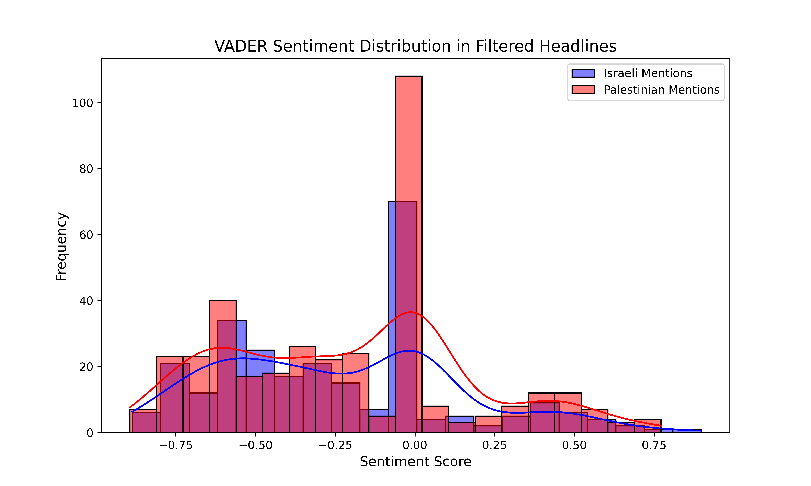

# Unbalanced Narratives: Deep-Learning Insights into *NYT* Coverage of the Israeli-Palestinian Conflict

## Abstract

Understanding how the Israeli–Palestinian conflict is framed in influential outlets like *The New York Times* (*NYT*) is crucial, as media narratives shape public opinion and can influence policy decisions. This analysis focuses on what most readers actually see—headlines.

I conducted a computational analysis of 563 *NYT* headlines published between October 1, 2023, and March 7, 2025. Metadata was retrieved using the *NYT* Article Search API and stored in a structured SQLite database. Articles were included if their headline contained any of 24 conflict-relevant terms (e.g., “Israel,” “Hamas,” “Genocide,” “UNRWA”). Mentions were categorized as “Israeli” (terms like “Israel,” “IDF,” or “Israeli”) or “Palestinian” (e.g., “Palestinian,” “Gaza,” “Hamas”).

Using BERT (Bidirectional Encoder Representations from Transformers), I embedded the headlines and grouped them into five thematic clusters via K-means clustering. Sentiment was assessed using both VADER (Valence Aware Dictionary for sEntiment Reasoner, a rule-based sentiment tool optimized for short texts) and a BERT-based classifier.

Sentiment differences: Israeli-related headlines were more negative on average (mean VADER score = –0.239) than Palestinian-related ones (mean = –0.208), though the difference was not statistically significant (Welch’s T-test, p = 0.297).

Coverage imbalance: Palestinian-related terms appeared in 375 headlines, compared to 267 for Israeli-related ones—a 40.5% higher frequency, with Palestinian terms mentioned 1.4 times for every Israeli mention. This disparity was statistically significant (Two-Proportion Z-Test, n = 563: Z = –6.501, p < 0.0001; restricting to only headlines containing either Israeli or Palestinian terms, n = 510: Z = –7.002, p < 0.0001).

## Impact Statement

This analysis reveals a disproportionate emphasis on Palestinian-related terms and a modestly more negative tone in headlines mentioning Israel—framing that may shape perceptions of Israel as the primary aggressor. Amid rising antisemitism in the U.S., on college campuses, and globally, this coverage trend raises questions about whether media framing could reinforce anti-Israel bias. These findings highlight the potential for headline-level bias to influence public understanding of complex geopolitical conflicts, underscoring the value of balanced reporting.

## Visual Results

*Figure 1: Proportions of mentions for Israeli and Palestinian terms from 10/01/2023 to 04/07/2025 in the *NYT*.*

---

  
*Figure 2: Number of mentions over time for Israeli and Palestinian terms, showing more Palestinian terms at most time points.*

---

# [Figure 3: Interactive PCA Plot](https://adams-charleen.github.io/nyt_deep_learning/pca_interactive.html) (click to open)
The interactive PCA plot visualizes headline clusters using color-coded points, accompanied by a legend. Each dot in the plot represents a *NYT* article. Hovering over it displays the title. Users can click on legend items to selectively toggle visibility, enabling focused exploration of specific clusters and narratives.

### Clustering Analysis

Using K-means clustering, the 563 headlines were grouped into five clusters (theme qualitatively assigned).

| Cluster | Theme                          | N Articles | Example Headline                                                                                              | Avg. Sentiment Score |
|--------:|--------------------------------|------------|---------------------------------------------------------------------------------------------------------------|----------------------|
| 0       | International Actions and Diplomacy | 73         | *Turkey Halts Trade With Israel Amid Deteriorating Relations*                                                | –0.521               |
| 1       | Conflict and Violence          | 59         | *How Iran and Israel Are Unnatural Adversaries*                                                              | +0.331               |
| 2       | Protests and Cultural Support  | 113        | *The U.S. Must Embrace Palestinian Statehood Now*                                                            | –0.137               |
| 3       | Peace Efforts and Politics     | 170        | *U.N. Body Demands Israel End Its ‘Unlawful Presence in the Occupied Palestinian Territory’*                | –0.653               |
| 4       | U.S. Politics and Protests     | 148        | *Three European Countries Formally Recognize Palestinian Statehood*                                         | –0.159               |

---

*Figure 4: Distribution of VADER sentiment score for Israeli and Palestinian terms*.

---

## Methods

Due to challenges in obtaining full article texts from the *NYT* website, I focused the analysis on article **headlines**. An initial attempt to scrape full texts using a script with the *NYT* API and Selenium was hindered by login requirements, CAPTCHAs, and anti-bot measures. Consequently, I analyzed headlines retrieved via the *NYT* API and stored in a SQLite database (`nyt_articles_metadata.db`). Below is a detailed description of the methods used in the second script to process and analyze these headlines using deep learning and statistical techniques. 

### Step 1: Data Retrieval and Storage
- **SQLite Database Access**: The API initially pulled all headlines (N=915) that contained my search terms in them or the text of their articles, even though I couldn't access the articles with the script. I utilized `sqlite3` to connect to the `nyt_articles_metadata.db` database, which stored metadata for *NYT* articles (headlines, URLs, publication dates, etc.) collected via the *NYT* API. The `pandas` library loaded this data into a DataFrame, yielding 563 articles after filtering for relevant terms. 
  - **Tool**: `sqlite3` is a lightweight, serverless database engine for efficient storage and querying of structured data.
  - **Tool**: `pandas` is a Python library for data manipulation, providing DataFrames for handling tabular data.

### Step 2: Filtering Headlines
- I filtered headlines containing terms related to the Israeli-Palestinian conflict (e.g., "Israel," "Palestinian," "Hamas," "Gaza") using `pandas` string operations, reducing the dataset to 563 relevant headlines.
  - **Tool**: `pandas` string methods enabled efficient, case-insensitive keyword filtering.

### Step 3: Proportion Analysis and Statistical Testing
- **Mention Counting**: I counted headlines mentioning Israeli terms (e.g., "Israel," "Israeli") and Palestinian terms (e.g., "Palestinian," "Gaza") using `pandas` string operations.
- **Proportion Calculation**: I computed the proportion of headlines mentioning each group (Israeli: 47%, Palestinian: 67%).
- **Two-Sample Proportion Z-Test**: I conducted a two-sided statistical test using `scipy.stats.norm` to compare the proportions of Israeli and Palestinian mentions, yielding a Z-statistic of -6.501 and a P-value of <0.000, confirming a statistically significant difference.
  - **Tool**: `scipy.stats.norm` provides statistical functions, including the normal distribution for z-tests.
- **Visualization**: I created a bar plot using `matplotlib.pyplot` to display the proportions, annotated with the Z-statistic and P-value.
  - **Tool**: `matplotlib.pyplot` is a plotting library for creating static visualizations like bar plots.

### Step 4: BERT Embeddings for Headline Representation
- **BERT Model Loading**: I used `transformers` to load a pre-trained BERT model (`bert-base-uncased`) and its tokenizer. BERT (Bidirectional Encoder Representations from Transformers) generates contextual word embeddings, capturing semantic meaning in text.
  - **Tool**: `transformers` (Hugging Face) provides access to pre-trained NLP models like BERT.
  - **Tool**: `torch` is a deep learning framework supporting tensor computations and model inference.
- **Embedding Generation**: I tokenized each headline using the BERT tokenizer and passed it through the BERT model to obtain embeddings. I extracted the `[CLS]` token embedding from the last hidden layer, resulting in a 768-dimensional vector per headline, stored as a NumPy array using `numpy`.
  - **Tool**: `numpy` is a library for numerical computations, enabling efficient array operations.

### Step 5: K-Means Clustering
- I applied K-means clustering to group the 563 headlines into 5 clusters based on their BERT embeddings, using `sklearn.cluster.KMeans` with a fixed random state for reproducibility.
  - **Tool**: `sklearn.cluster.KMeans` is a machine learning algorithm that partitions data into clusters by minimizing intra-cluster variance.
- I assigned cluster labels to each headline and analyzed the clusters for Israeli and Palestinian mentions, calculating proportions within each cluster.

### Step 6a: Sentiment Analysis with BERT
- **Sentiment Model**: I employed a pre-trained BERT-based sentiment model (`nlptown/bert-base-multilingual-uncased-sentiment`) via `transformers.pipeline` to predict headline sentiment. The model outputs a star rating (1 to 5), which I mapped to a sentiment score from -1 (negative) to 1 (positive).
  - **Tool**: `transformers.pipeline` simplifies the use of pre-trained models for tasks like sentiment analysis.
- I computed the average sentiment for each cluster, revealing distinct tonal variations (e.g., Cluster 1: 0.331, Cluster 3: -0.653).

### Step 6b: Sentiment Analysis with VADER
- **Sentiment Model**: I utilized a rules-based, pretrained model designed for texts and social media, to assess the polarity of headlines based on lexical cues for subgroups.
  
### Step 7: Temporal Analysis
- I converted publication dates to monthly periods using `pandas` datetime functionality and grouped the data by month and cluster.
- For each cluster, I calculated:
  - Monthly counts of Israeli and Palestinian mentions.
  - Monthly average sentiment scores.
- I visualized these trends using `matplotlib.pyplot`, creating individual plots for each cluster and panel plots across all clusters.
  - **Tool**: `pandas` datetime operations enabled temporal grouping and analysis.

### Step 8: PCA Visualization
- **Dimensionality Reduction**: I used `sklearn.decomposition.PCA` to reduce the 768-dimensional BERT embeddings to 2 dimensions for visualization.
  - **Tool**: `sklearn.decomposition.PCA` projects high-dimensional data into a lower-dimensional space while preserving variance.
- **Static Plot**: I created a scatter plot using `seaborn.scatterplot`, coloring points by cluster and adding a legend with cluster descriptions, sizes, and mention proportions.
  - **Tool**: `seaborn` is a statistical visualization library built on `matplotlib`.
- **Interactive Plot**: I used `plotly.express` and `plotly.graph_objects` to create an interactive scatter plot with a subplot showing mention proportions, including hover tooltips and statistical annotations.
  - **Tool**: `plotly.express` and `plotly.graph_objects` enable interactive visualizations with hover effects and subplots.
  - **Tool**: `plotly.subplots.make_subplots` supports multi-panel layouts.
